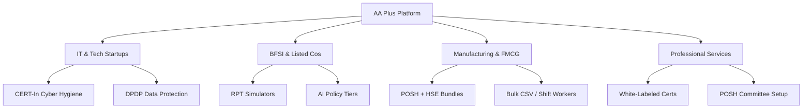

# AA Plus Policy Training Platform — Startup Pitch Deck

> **Slogan:** India's Premier Regulatory-First B2B Compliance Training Platform
> **Target Audience:** Indian SMBs, Listed Companies, BFSI, Tech Startups, and Enterprises
> **Date:** May 2026

---

## 🚀 Presentation Slide Carousel

```carousel
# Slide 1: Cover

**India's Premier India-Native B2B Compliance Training Platform**
*11+ Regulatory Modules • Verifiable Certificates • Audit-Ready Reporting • Deep Obsidian Theme*
<!-- slide -->
# Slide 2: The Problem
### Compliance Training in India is Broken
- **Too Expensive**: Global LMS players (SAP Litmos, KnowBe4) cost ₹10 Lakh+/year for 500 users. Too rich for Indian SMBs.
- **Too Narrow**: India-native vendors (POSH Check) only cover POSH. No DPDP Act 2023, CERT-In Cybersecurity, or AI governance.
- **Empty Shells**: Platforms like TalentLMS or Disprz require HR to build all compliance courses from scratch (months of work).
- **No Audit Trails**: Completion tracked in brittle Excel sheets without QR-verifiable proof. Fails regulatory inspections.
<!-- slide -->
# Slide 3: The Solution
### One Platform. All Regulations. Audit-Ready.
- **Bundled Compliance Content**: 11+ pre-built, highly-interactive, India-native regulatory modules ready on Day 1.
- **Verifiable Proof**: Auto-generated PDF certificates with cryptographically secure QR code verification.
- **Advanced Admin Suite**: Department-level assignments, automated email nudges, Slack/Teams webhooks, and full Excel audit logs.
- **India-First Commercials**: Clear, transparent INR pricing, GST-compliant invoicing, and native Razorpay integration.
<!-- slide -->
# Slide 4: 11+ Compliance Modules
### Complete Regulatory Coverage Out-of-the-Box
1. **POSH Act 2013** (Sexual Harassment prevention + custom ICC embedding)
2. **DPDP Act 2023** (India's brand-new Digital Personal Data Protection Act)
3. **CERT-In Cybersecurity** (MeitY-aligned incident reporting & cyber hygiene)
4. **Anti-Corruption** (India's Prevention of Corruption Act + global FCPA compliance)
5. **Code of Conduct** (Ethics, conflict of interest, gifts, and hospitality)
6. **AI Policy Tiers** (3-tier framework for AI governance: Restricted, Standard, Responsible)
7. **RPT Simulator** (Related Party Transaction interactive simulation for listed companies)
8. **Whistleblower Policy** (Vigil mechanism, protected disclosure, anti-retaliation)
9. **Data Privacy (General)** (GDPR basics, data handling, and employee rights)
10. **Information Security** (Phishing awareness, passwords, and device safety)
11. **HSE (Health, Safety & Environment)** (Factory Act, fire safety, and ergonomics)
<!-- slide -->
# Slide 5: The Learner Experience
### Engaging, Mobile-Optimized, and Fast
- **Clean Sidebar Navigation**: Easy module progression tracking.
- **Self-Paced Learning Slides**: Visually engaging, concise screens with real-life scenarios.
- **Randomized Quizzes**: 10 questions picked at random from a large pool to ensure real comprehension. 70% passing threshold.
- **Explanation Cards**: Instant feedback with clear explanations for both correct and incorrect answers.
- **LinkedIn Integration**: One-click sharing of certificates to professional networks.
<!-- slide -->
# Slide 6: Verifiable QR Certificates
### Unquestionable Proof for Regulators & Auditors
- **Instant Generation**: Triggered automatically the second the learner passes the quiz.
- **Audit-Ready QR Code**: Auditors scan the QR code to verify authenticity in real-time on `training.aaplus.app/verify`.
- **Org Branding**: White-labeled with the company logo (available on Scale+ plans).
- **Bulk Certificate Export**: Admins can export all certificates as a structured ZIP file in one click.
- **12-Month Expiry**: Automatic triggers to prompt annual recertification, keeping the company continuously compliant.
<!-- slide -->
# Slide 7: Admin Control Center
### Total Compliance Visibility — Zero Spreadsheets
- **Live Completion Rings**: Interactive visual compliance rate by organization and department.
- **Bulk User Management**: Invite hundreds of employees in seconds using CSV upload with auto-preview.
- **Automated Nudge Engine**: System automatically sends email reminders 7, 3, and 1 day before deadlines.
- **Granular Controls**: Department-level module mapping, superadmin deadline locks, and manager access views.
- **Compliance Audit Trails**: Instant Excel export containing logins, quiz scores, completions, and admin events.
<!-- slide -->
# Slide 8: Value Multipliers
### Features Competitors Cannot Match
- **POSH Wizard**: Embeds registered address, helpline, and Internal Committee (ICC) details directly into slides.
- **AI Policy Quiz**: 4-question assessment gates user-level AI module assignment based on actual company usage.
- **RPT Simulator**: Interactive board-level scenario training for high-risk Related Party Transactions.
<!-- slide -->
# Slide 9: Competitive Matrix
| Feature | AA Plus (Business) | POSH Check Pro | Ethena (US) | TalentLMS Grow | Disprz |
| :--- | :---: | :---: | :---: | :---: | :---: |
| **India Content** | **Yes (11+ Modules)** | POSH Only | No | None | Some |
| **Bundled Content**| **Yes (Included)** | Yes | Yes | No (LMS Only) | No |
| **Audit Trails** | **Yes (QR Certs)** | Basic | Yes | Basic | Yes |
| **Unique Simulators**| **Yes (RPT / AI Quiz)** | No | No | No | No |
| **Annual Cost (100)**| **₹90,000** | ₹55,000 | ~₹1,70,000 | ~₹2,30,000 | ~₹3,00,000 |
<!-- slide -->
# Slide 10: Pricing Strategy
### Predictable, Transparent, GST-Compliant INR Tiers
- **Essentials**: ₹36,000/yr (Up to 25 users, ₹1,440/user/yr)
- **Business**: ₹90,000/yr (Up to 100 users, ₹900/user/yr)
- **Professional**: ₹1,80,000/yr (Up to 250 users, ₹720/user/yr)
- **Corporate**: ₹3,00,000/yr (Up to 500 users, ₹600/user/yr)
- **Enterprise**: Custom Quote (500+ users, volume discounted to ₹350–500/user/yr)
- **ROI Hook**: Business plan costs only **₹2.47 per employee per day** — less than a cup of cutting chai!
<!-- slide -->
# Slide 11: Market Tailwinds
### The Exploding Compliance Landscape in India
- **DPDP Act 2023 Enforcement**: Statutory penalties up to **₹250 Crore** for data breaches and lack of employee data training.
- **POSH Mandate Scrutiny**: High Courts and SEBI tightening compliance. Listed companies must certify training in annual reports.
- **CERT-In Guidelines**: MeitY demands cyber reporting within 6 hours and mandatory employee cyber hygiene training.
- **B2B Trust Shift**: Compliance has moved from a "tick-box HR requirement" to a critical security and vendor-onboarding prerequisite.
<!-- slide -->
# Slide 12: Call To Action
### Start Your Compliance Journey Today
- **14-Day Free Trial**: Full-featured, up to 10 users, no credit card required.
- **Live 30-Min Demo**: Comprehensive walkthrough for HR & legal teams.
- **Contact:** `praveen@aaplusconsultants.com`
- **Web:** `training.aaplus.app`
```

---

## 📈 Executive Summary

The **AA Plus Policy Training Platform** represents a major shift in compliance training for the Indian corporate sector. Historically, Indian businesses had to choose between **costly global LMS platforms** (which are empty shells and lack localized regulatory content) and **fragmented, narrow single-subject providers** (like POSH-only tools). 

AA Plus bridges this gap by offering a **bundled, content-rich, B2B SaaS platform** tailored specifically for Indian regulatory compliance (POSH, DPDP Act 2023, CERT-In, RPT, AI Governance). It delivers immediate value out of the box with verifiable QR-coded certificates and deep admin automations, priced to win Indian SMBs and mid-market organizations.

> [!NOTE]
> **Why this Pitch Deck Wins:**
> - **Exhaustive Scope**: Covers the full product ecosystem including unique value drivers like the RPT Simulator, POSH Wizard, and AI Policy Quiz.
> - **Competitive Framing**: Visually highlights the severe price-to-value gap of traditional LMS platforms.
> - **Bulletproof ROI**: Redefines B2B subscription pricing (Business plan) as just **₹2.47 per employee per day**, making the purchase decision a no-brainer for CFOs and HR heads.

---

## 🎯 Target Audience Segments



---

## 📊 Market Opportunities & Competitive Advantage

| Competitor Type | Competitors | Cost Index | Content Gaps | AA Plus Advantage |
| :--- | :--- | :---: | :--- | :--- |
| **Global Compliance Spec** | Ethena, Skillcast | 🔴 Very High | US/UK centric; lacks DPDP Act 2023, CERT-In, and POSH ICC | India-native compliance built from ground-up, compliant with local laws. |
| **Traditional LMS** | SAP Litmos, TalentLMS | 🟡 Medium | No content; HR must write and design all modules from scratch | Full library of 11+ modules ready to deploy immediately. |
| **Point Compliance Solutions** | POSH Check Pro | 🔴 High | POSH only; leaves orgs exposed on cybersecurity and privacy | 11-in-1 suite undercuts POSH-only pricing while offering full suite. |

---

## 🛡️ Indian Compliance Landscape Drivers (May 2026)

> [!WARNING]
> **DPDP Act 2023 Compliance is Non-Negotiable**
> Under the Digital Personal Data Protection Act 2023, organizations processing personal data must implement data hygiene training. Violations carry statutory penalties of up to **₹250 Crore**. A simple audit trail on spreadsheets is no longer accepted.

> [!IMPORTANT]
> **SEBI and POSH Act 2013 Board Mandates**
> The Securities and Exchange Board of India (SEBI) requires listed entities to confirm in their Business Responsibility and Sustainability Report (BRSR) that 100% of employees have undergone POSH compliance training. AA Plus guarantees automated, verified reporting for quick compliance audits.

---

## 💎 The Unique Value Pillars of AA Plus

1. **POSH Wizard (Custom Embedding)**
   Most POSH courses are generic videos. AA Plus dynamically injects the company's specific **Internal Complaints Committee (ICC) members**, registered company address, phone numbers, and escalation policies directly into the learning slides. This makes the training legally valid and highly localized.

2. **3-Tier AI Policy Quiz**
   AI governance is crucial. Admins answer a 4-question assessment about corporate AI use (e.g., *Is ChatGPT used for client code? Are HR documents parsed by AI?*). The platform determines the company's risk profile and auto-assigns the matching **AI Policy Training** (Restricted, Standard, or Responsible Use) to all employees.

3. **RPT (Related Party Transaction) Simulator**
   Listed companies face severe scrutiny on RPTs. AA Plus provides an interactive simulator where managers navigate realistic board-room conflicts, disclosures, and approvals. It is a highly specialized compliance training module that normally costs lakhs in custom legal workshops.

---

## 📬 Contact and Onboarding Next Steps

- **14-Day Pilot Plan**: Deploy a free sandbox for up to 10 users to test dashboard tracking and the module player.
- **Custom Corporate Demos**: Request a personalized demo showing organization white-labeling and webhook tracking.
- **Partnership / CA Program**: CA firms, audit partners, and HR consultancies can join our referral program for 15-20% commission.

*Developed in partnership with AA Plus Consultants. For details, visit [training.aaplus.app](https://training.aaplus.app) or email `praveen@aaplusconsultants.com`.*
